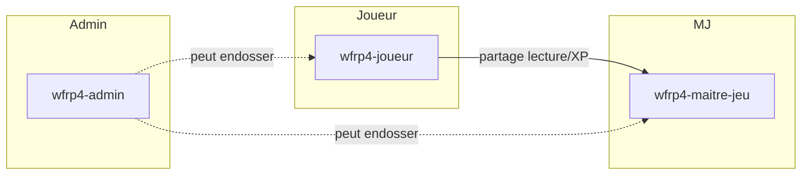
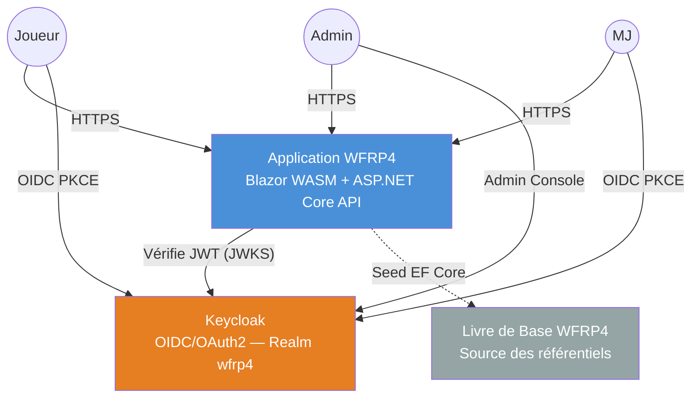
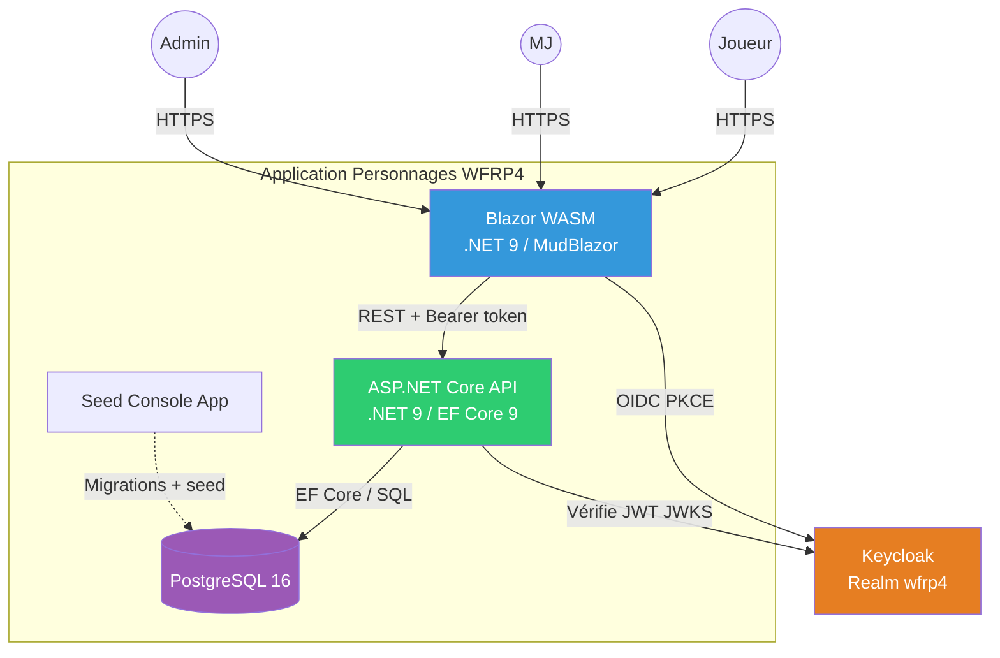
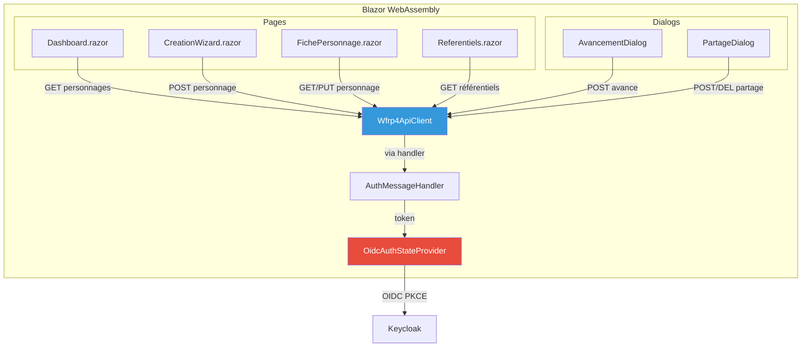
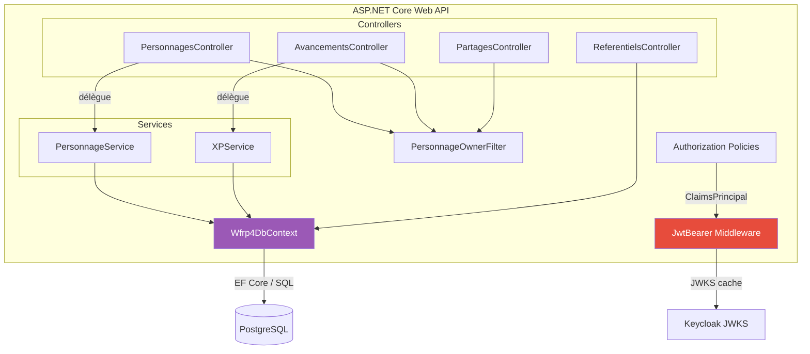
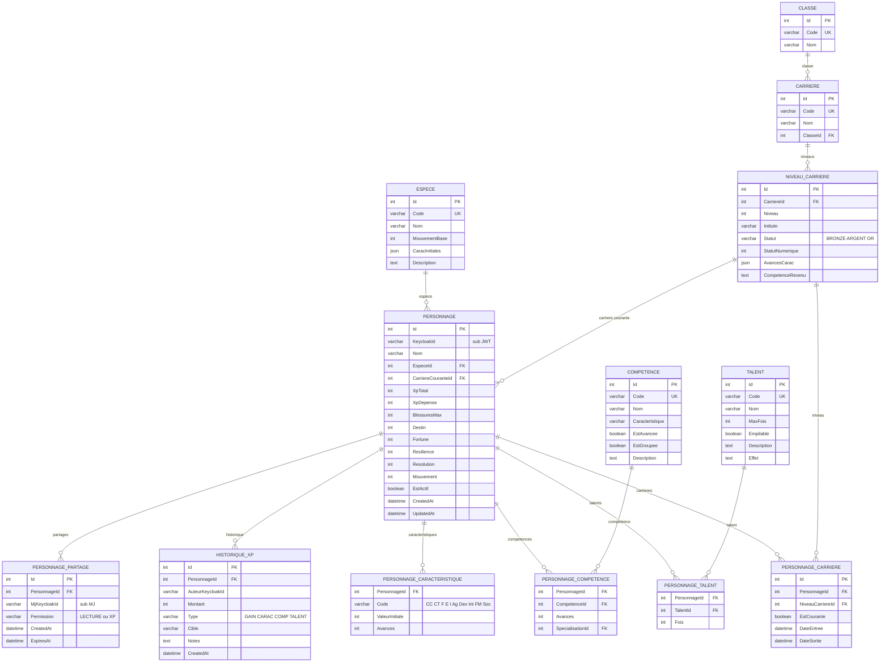
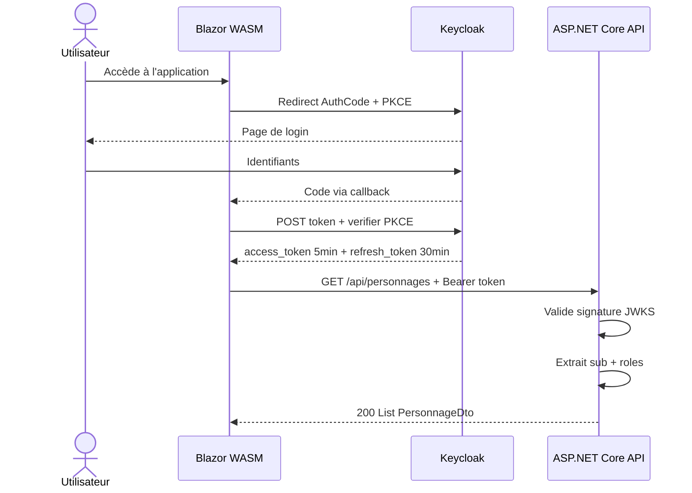

# Spécification — Application de Gestion de Personnages WFRP4

> **Version** : 0.4 — Architecture cible : Blazor WebAssembly + MudBlazor + ASP.NET Core + EF Core  
> **Date** : Mars 2026  
> **Source** : Warhammer Fantasy Roleplay 4e Édition — Livre de Base (FR)

---

## Table des Matières

1. [Contexte Fonctionnel](#1-contexte-fonctionnel)
2. [Stack Technique](#2-stack-technique)
3. [Modèle de Rôles Utilisateur](#3-modèle-de-rôles-utilisateur)
4. [C4 — Niveau 1 : Contexte Système](#4-c4--niveau-1--contexte-système)
5. [C4 — Niveau 2 : Conteneurs](#5-c4--niveau-2--conteneurs)
6. [C4 — Niveau 3 : Composants](#6-c4--niveau-3--composants)
7. [Structure Solution .NET](#7-structure-solution-net)
8. [Modèle de Données — EF Core](#8-modèle-de-données--ef-core)
9. [Intégration Keycloak](#9-intégration-keycloak)
10. [Contrôle d'Accès](#10-contrôle-daccès)
11. [Contraintes et Règles Métier](#11-contraintes-et-règles-métier)
12. [Cas d'Utilisation Principaux](#12-cas-dutilisation-principaux)

---

## 1. Contexte Fonctionnel

L'application permet à des utilisateurs authentifiés de **créer, gérer et faire évoluer** des personnages conformément aux règles du Livre de Base WFRP4. Chaque personnage appartient à un utilisateur et peut être **partagé en lecture** avec un Maître de Jeu.

L'authentification est **déléguée à Keycloak** (OIDC/OAuth2). L'application ne stocke ni mot de passe, ni session.

### Périmètre v1

| Fonctionnalité | Inclus |
|---|---|
| Authentification via Keycloak (OIDC) | ✅ |
| Gestion des comptes / rôles via Keycloak Admin | ✅ |
| Création de personnage (9 étapes) — par le propriétaire | ✅ |
| Gestion des caractéristiques et avances | ✅ |
| Gestion des compétences et avances | ✅ |
| Gestion des talents | ✅ |
| Suivi de carrière et progression | ✅ |
| Calcul XP (dépense / solde) | ✅ |
| Référentiel : espèces, classes, carrières | ✅ |
| Référentiel : compétences et talents | ✅ |
| Partage lecture / XP avec un MJ | ✅ |
| Export feuille de personnage (PDF) | ❌ v2 |
| Gestion de campagne / groupe | ❌ v2 |
| Gestion du combat / blessures en temps réel | ❌ v2 |

---

## 2. Stack Technique

| Couche | Technologie | Rôle |
|---|---|---|
| **Frontend** | Blazor WebAssembly (.NET 9) | SPA compilée en WASM, exécutée dans le navigateur |
| **UI Components** | MudBlazor | Bibliothèque Material Design pour Blazor |
| **Auth Frontend** | `Microsoft.AspNetCore.Components.WebAssembly.Authentication` | Flux OIDC Authorization Code + PKCE intégré |
| **API** | ASP.NET Core 9 Web API | API REST, hébergement du WASM en mode Hosted |
| **ORM** | Entity Framework Core 9 | Modèle entités, migrations, accès PostgreSQL |
| **Base de données** | PostgreSQL 16 | Stockage principal |
| **Auth serveur** | `Microsoft.AspNetCore.Authentication.JwtBearer` | Validation JWT Keycloak (JWKS) |
| **IAM** | Keycloak 25+ | OIDC/OAuth2, gestion des comptes et des rôles |
| **Seed** | Console App .NET / Script EF Core Data Seeding | Import référentiels WFRP4 |

### Mode déploiement

Le projet suit le pattern **ASP.NET Core Blazor Hosted** :
- L'API ASP.NET Core **sert statiquement** le bundle WASM Blazor.
- Un seul déploiement (conteneur ou IIS) héberge les deux.
- La communication Frontend → API se fait via `HttpClient` injecté, pointant sur la même origine.

---

## 3. Modèle de Rôles Utilisateur

Les rôles sont définis dans le **Realm Keycloak** `wfrp4` et portés dans le claim `realm_access.roles` du JWT.



**Détails des rôles :**

| Rôle Keycloak | Policy ASP.NET Core | Droits |
|---|---|---|
| `wfrp4-joueur` | `Policy("Joueur")` | Crée ses personnages, gère ses avances, voit uniquement ses personnages |
| `wfrp4-maitre-jeu` | `Policy("MaitreJeu")` | Voit les personnages partagés, ajoute de l'XP, lecture seule sur la fiche |
| `wfrp4-admin` | `Policy("Admin")` | Accès complet, gère les référentiels, gestion des rôles via Keycloak |

---

## 4. C4 — Niveau 1 : Contexte Système



---

## 5. C4 — Niveau 2 : Conteneurs



---

## 6. C4 — Niveau 3 : Composants

### 6.1 Blazor WebAssembly (Frontend)



**Composants détaillés :**

| Composant | Technologie | Rôle |
|---|---|---|
| `OidcAuthStateProvider` | MS WebAssembly.Authentication | Flux OIDC PKCE, stockage tokens, AuthenticationState |
| `AuthMessageHandler` | DelegatingHandler | Injecte Bearer token dans les requêtes HttpClient |
| `MainLayout + NavMenu` | MudBlazor MudLayout | Shell, navigation, profil connecté |
| `Dashboard.razor` | MudGrid / MudCard | Liste personnages, accès fiches partagées (MJ) |
| `CreationWizard.razor` | MudStepper | 9 étapes guidées, validation par étape |
| `FichePersonnage.razor` | MudTabs / MudDataGrid | Fiche complète, édition inline, mode lecture MJ |
| `AvancementDialog.razor` | MudDialog | Dépense XP, coût temps réel, validation carrière |
| `PartageDialog.razor` | MudDialog | Invite MJ, permissions, révocation |
| `Referentiels.razor` | MudDataGrid | Consultation référentiels, édition admin |
| `Wfrp4ApiClient.cs` | HttpClient typé | Routes typées, sérialisation JSON |

### 6.2 ASP.NET Core Web API



**Composants détaillés :**

| Composant | Rôle |
|---|---|
| `JwtBearer Middleware` | Valide JWT Keycloak (Authority realm URL, Audience wfrp4-api, signature JWKS). Injecte ClaimsPrincipal. |
| `Authorization Policies` | Policies : Joueur (`wfrp4-joueur`), MaitreJeu (`wfrp4-maitre-jeu`), Admin (`wfrp4-admin`). Claim mapping depuis `realm_access.roles`. |
| `PersonnageOwnerFilter` | IAsyncActionFilter. Vérifie `personnage.keycloak_id == sub` ou partage valide. Retourne 403 sinon. |
| `PersonnagesController` | CRUD `/api/personnages`. Filtre automatique par `keycloak_id`. `[Authorize(Policy=Joueur)]` |
| `PartagesController` | POST/DELETE `/api/personnages/{id}/partages`. Ownership filter. |
| `AvancementsController` | POST `/api/personnages/{id}/avances` (Joueur). POST `.../xp` (MJ, Permission=XP). |
| `ReferentielsController` | GET `/api/especes`, `/api/carrieres`, `/api/competences`, `/api/talents`. Écriture `[Authorize(Policy=Admin)]`. |
| `PersonnageService` | Calculs dérivés WFRP4. Validation avances selon plan de carrière courante. |
| `XPService` | Calcul coût XP selon tableaux officiels (p. 47). Validation solde disponible. |
| `Wfrp4DbContext` | DbSet Personnage, Espece, Carriere, etc. Migrations code-first. PostgreSQL (Npgsql). |

---

## 7. Structure Solution .NET

```
Wfrp4.sln
├── src/
│   ├── Wfrp4.Client/                  # Blazor WebAssembly (.NET 9)
│   │   ├── Pages/
│   │   │   ├── Dashboard.razor
│   │   │   ├── CreationWizard.razor
│   │   │   ├── FichePersonnage.razor
│   │   │   └── Referentiels.razor
│   │   ├── Components/
│   │   │   ├── AvancementDialog.razor
│   │   │   └── PartageDialog.razor
│   │   ├── Services/
│   │   │   └── Wfrp4ApiClient.cs
│   │   ├── Layout/
│   │   │   ├── MainLayout.razor
│   │   │   └── NavMenu.razor
│   │   └── Program.cs
│   │
│   ├── Wfrp4.Server/                  # ASP.NET Core Web API (.NET 9)
│   │   ├── Controllers/
│   │   │   ├── PersonnagesController.cs
│   │   │   ├── AvancementsController.cs
│   │   │   ├── PartagesController.cs
│   │   │   └── ReferentielsController.cs
│   │   ├── Filters/
│   │   │   └── PersonnageOwnerFilter.cs
│   │   ├── Services/
│   │   │   ├── PersonnageService.cs
│   │   │   └── XPService.cs
│   │   └── Program.cs
│   │
│   ├── Wfrp4.Infrastructure/          # EF Core, PostgreSQL
│   │   ├── Data/
│   │   │   ├── Wfrp4DbContext.cs
│   │   │   ├── Configurations/
│   │   │   │   ├── PersonnageConfiguration.cs
│   │   │   │   ├── EspeceConfiguration.cs
│   │   │   │   └── ...
│   │   │   └── Migrations/
│   │   └── Repositories/
│   │       └── PersonnageRepository.cs
│   │
│   └── Wfrp4.Shared/                  # DTOs, contrats API
│       ├── DTOs/
│       │   ├── PersonnageDto.cs
│       │   ├── AvanceRequest.cs
│       │   └── XPGrantRequest.cs
│       └── Models/
│
├── tools/
│   └── Wfrp4.Seed/                    # Console App — seed référentiels
│       └── Program.cs
│
└── tests/
    ├── Wfrp4.Server.Tests/
    └── Wfrp4.Infrastructure.Tests/
```

---

## 8. Modèle de Données — EF Core

### 8.1 Entités principales

```csharp
// Clé naturelle de l'utilisateur — sub Keycloak
// Pas d'entité Utilisateur : le sub est stocké directement dans Personnage

public class Personnage
{
    public int Id { get; set; }
    public string KeycloakId { get; set; } = null!;   // sub JWT — INDEX
    public string Nom { get; set; } = null!;

    public int EspeceId { get; set; }
    public Espece Espece { get; set; } = null!;

    public int? CarriereCouranteId { get; set; }
    public NiveauCarriere? CarriereCourante { get; set; }

    public int XpTotal { get; set; }
    public int XpDepense { get; set; }

    // Attributs dérivés stockés (recalculés à la création)
    public int BlessuresMax { get; set; }
    public int Destin { get; set; }
    public int Fortune { get; set; }
    public int Resilience { get; set; }
    public int Resolution { get; set; }
    public int Mouvement { get; set; }

    // Détails
    public string? Motivation { get; set; }
    public string? StatutSocial { get; set; }
    public string? Age { get; set; }
    public string? CouleurYeux { get; set; }
    public string? CouleurCheveux { get; set; }
    public int? TailleCm { get; set; }
    public bool EstActif { get; set; } = true;
    public DateTime CreatedAt { get; set; }
    public DateTime UpdatedAt { get; set; }

    // Navigation
    public ICollection<PersonnageCaracteristique> Caracteristiques { get; set; } = [];
    public ICollection<PersonnageCompetence> Competences { get; set; } = [];
    public ICollection<PersonnageTalent> Talents { get; set; } = [];
    public ICollection<HistoriqueXP> HistoriqueXP { get; set; } = [];
    public ICollection<PersonnageCarriere> Carrieres { get; set; } = [];
    public ICollection<PersonnagePartage> Partages { get; set; } = [];
}

public class PersonnagePartage
{
    public int Id { get; set; }
    public int PersonnageId { get; set; }
    public string MjKeycloakId { get; set; } = null!;   // sub du MJ
    public PermissionPartage Permission { get; set; }    // LECTURE | XP
    public DateTime CreatedAt { get; set; }
    public DateTime? ExpiresAt { get; set; }
}

public class HistoriqueXP
{
    public int Id { get; set; }
    public int PersonnageId { get; set; }
    public string AuteurKeycloakId { get; set; } = null!;
    public int Montant { get; set; }   // positif = gain, négatif = dépense
    public TypeXP Type { get; set; }   // GAIN | CARAC | COMPETENCE | TALENT | CARRIERE
    public string? Cible { get; set; }
    public string? Notes { get; set; }
    public DateTime CreatedAt { get; set; }
}
```

### 8.2 Configuration EF Core (exemple)

```csharp
public class PersonnageConfiguration : IEntityTypeConfiguration<Personnage>
{
    public void Configure(EntityTypeBuilder<Personnage> builder)
    {
        builder.HasIndex(p => p.KeycloakId);

        builder.HasOne(p => p.Espece)
               .WithMany()
               .HasForeignKey(p => p.EspeceId)
               .OnDelete(DeleteBehavior.Restrict);

        builder.HasMany(p => p.Caracteristiques)
               .WithOne()
               .HasForeignKey(pc => pc.PersonnageId)
               .OnDelete(DeleteBehavior.Cascade);

        builder.Property(p => p.UpdatedAt)
               .ValueGeneratedOnAddOrUpdate();
    }
}
```

### 8.3 Diagramme ERD



### 8.4 Coût XP (source : Livre de Base p. 47)

| Avances | Coût Caractéristique | Coût Compétence |
|---|---|---|
| 0 – 5 | 25 XP | 10 XP |
| 6 – 10 | 30 XP | 15 XP |
| 11 – 15 | 40 XP | 20 XP |
| 16 – 20 | 50 XP | 30 XP |
| 21 – 25 | 70 XP | 40 XP |
| 26 – 30 | 90 XP | 60 XP |
| 31 – 35 | 120 XP | 80 XP |
| 36 – 40 | 150 XP | 110 XP |
| 41 – 45 | 190 XP | 140 XP |
| 46 – 50 | 230 XP | 180 XP |

---

## 9. Intégration Keycloak

### 9.1 Configuration Realm `wfrp4`

| Paramètre | Valeur |
|---|---|
| Realm | `wfrp4` |
| Client SPA | `wfrp4-blazor` — Public, Authorization Code + PKCE |
| Client API | `wfrp4-api` — Bearer-only |
| Rôles Realm | `wfrp4-joueur`, `wfrp4-maitre-jeu`, `wfrp4-admin` |
| Token lifetime | access_token: 5 min / refresh_token: 30 min |
| Claim ID | `sub` (UUID stable) |

### 9.2 Configuration Blazor WebAssembly (`Program.cs`)

```csharp
builder.Services.AddOidcAuthentication(options =>
{
    options.ProviderOptions.Authority = "https://keycloak.example.com/realms/wfrp4";
    options.ProviderOptions.ClientId = "wfrp4-blazor";
    options.ProviderOptions.ResponseType = "code";
    options.ProviderOptions.DefaultScopes.Add("openid");
    options.ProviderOptions.DefaultScopes.Add("profile");
    options.ProviderOptions.DefaultScopes.Add("email");
});

builder.Services.AddHttpClient<Wfrp4ApiClient>(
    client => client.BaseAddress = new Uri(builder.HostEnvironment.BaseAddress))
    .AddHttpMessageHandler<AuthorizationMessageHandler>();
```

### 9.3 Configuration ASP.NET Core (`Program.cs`)

```csharp
builder.Services.AddAuthentication(JwtBearerDefaults.AuthenticationScheme)
    .AddJwtBearer(options =>
    {
        options.Authority = "https://keycloak.example.com/realms/wfrp4";
        options.Audience = "wfrp4-api";
        options.TokenValidationParameters = new TokenValidationParameters
        {
            ValidateIssuer = true,
            ValidateAudience = true,
            ValidateLifetime = true,
            RoleClaimType = "http://schemas.microsoft.com/ws/2008/06/identity/claims/role"
        };
    });

builder.Services.AddAuthorization(options =>
{
    options.AddPolicy("Joueur",    p => p.RequireRole("wfrp4-joueur"));
    options.AddPolicy("MaitreJeu", p => p.RequireRole("wfrp4-maitre-jeu"));
    options.AddPolicy("Admin",     p => p.RequireRole("wfrp4-admin"));
});
```

> **Note** : La résolution des rôles Keycloak depuis `realm_access.roles` nécessite un `IClaimsTransformation` ou un mapper dans `TokenValidationParameters` pour aplatir les claims imbriqués.

### 9.4 Flux d'authentification



---

## 10. Contrôle d'Accès

### Matrice de permissions

| Action | Joueur (proprio) | Joueur (autre) | MJ (partagé) | MJ (non partagé) | Admin |
|---|:---:|:---:|:---:|:---:|:---:|
| Créer personnage | ✅ | — | — | — | ✅ |
| Lire fiche | ✅ | ❌ | ✅ | ❌ | ✅ |
| Modifier fiche | ✅ | ❌ | ❌ | ❌ | ✅ |
| Dépenser XP | ✅ | ❌ | ❌ | ❌ | ✅ |
| Octroyer XP | ❌ | ❌ | ✅ | ❌ | ✅ |
| Partager | ✅ | ❌ | ❌ | ❌ | ✅ |
| Supprimer | ✅ | ❌ | ❌ | ❌ | ✅ |

---

## 11. Contraintes et Règles Métier

### Avancement

- Un personnage ne peut avancer **que les caractéristiques de son niveau de carrière** (et niveaux inférieurs).
- Un personnage ne peut avancer **que les compétences listées** à son niveau ou inférieur.
- Talent empilable : `Fois < MaxFois` (ou `MaxFois == null` = illimité).

### Changement de carrière

- Même classe : accès libre.
- Classe différente : niveau actuel doit être complété (p. 48 Livre de Base).
- Historique conservé dans `PersonnageCarriere`.

### XP

- `XpDepense` = somme des montants négatifs de `HistoriqueXP`.
- `XpRestant = XpTotal - XpDepense` — calculé à la volée, jamais persisté.
- Chaque ligne `HistoriqueXP` trace l'`AuteurKeycloakId`.

---

## 12. Cas d'Utilisation Principaux

### UC-00 — Authentification (Keycloak)

```
Inscription : console Keycloak Admin (ou self-registration realm)
              → assignation rôle wfrp4-joueur | wfrp4-maitre-jeu

Connexion :
  1. Clic "Se connecter" dans Blazor
  2. Redirect Keycloak (OIDC PKCE via AddOidcAuthentication)
  3. Login Keycloak → retour /authentication/login-callback
  4. Échange code → access_token stocké en mémoire WASM

Déconnexion :
  1. Appel Keycloak /logout (SSO logout)
  2. Tokens mémoire effacés
```

### UC-01 — Création d'un personnage

```
1. Joueur (wfrp4-joueur) ouvre CreationWizard.razor (MudStepper 9 étapes)
2. Étape 1 : sélection espèce → GET /api/especes
3. Étape 2 : sélection classe/carrière → GET /api/carrieres
4. Étapes 3-9 : formulaires avec validation MudBlazor
5. Soumission → POST /api/personnages
6. API : KeycloakId = User.FindFirst("sub").Value
7. PersonnageService calcule blessures, destin, résolution
8. SaveChanges → redirection vers FichePersonnage.razor
```

### UC-02 — Dépenser de l'XP

```
1. Joueur ouvre AvancementDialog sur FichePersonnage
2. Sélectionne : Caractéristique | Compétence | Talent
3. Blazor affiche le coût estimé (XPService côté client)
4. Confirmation → POST /api/personnages/{id}/avances
5. API vérifie ownership (PersonnageOwnerFilter)
6. XPService vérifie plan de carrière + coût + solde
7. Insère HistoriqueXP + met à jour XpDepense
```

### UC-03 — Partager avec un MJ

```
1. Joueur ouvre PartageDialog
2. Saisit email ou username du MJ
3. POST /api/personnages/{id}/partages
4. API résout le sub via Keycloak Admin API
5. Vérifie rôle wfrp4-maitre-jeu du sub cible
6. Insère PersonnagePartage
```

### UC-04 — Octroyer de l'XP (MJ)

```
1. MJ consulte FichePersonnage (mode lecture, personnage partagé)
2. Clique "Octroyer XP"
3. POST /api/personnages/{id}/xp
4. API vérifie Permission=XP dans PersonnagePartage
5. Insère HistoriqueXP (Montant positif, AuteurKeycloakId = MJ sub)
6. XpTotal mis à jour
```