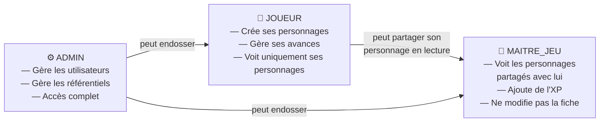
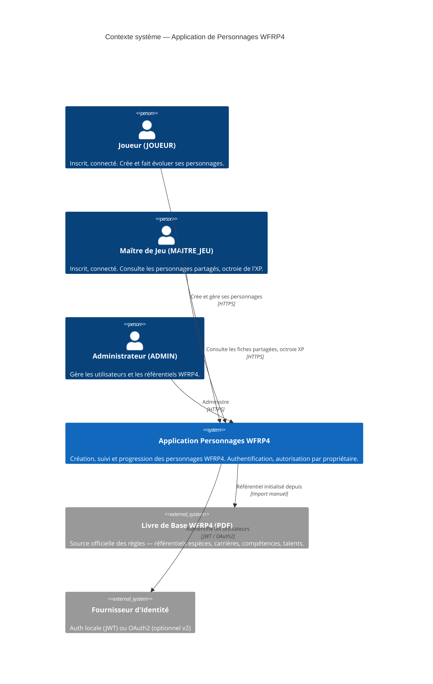
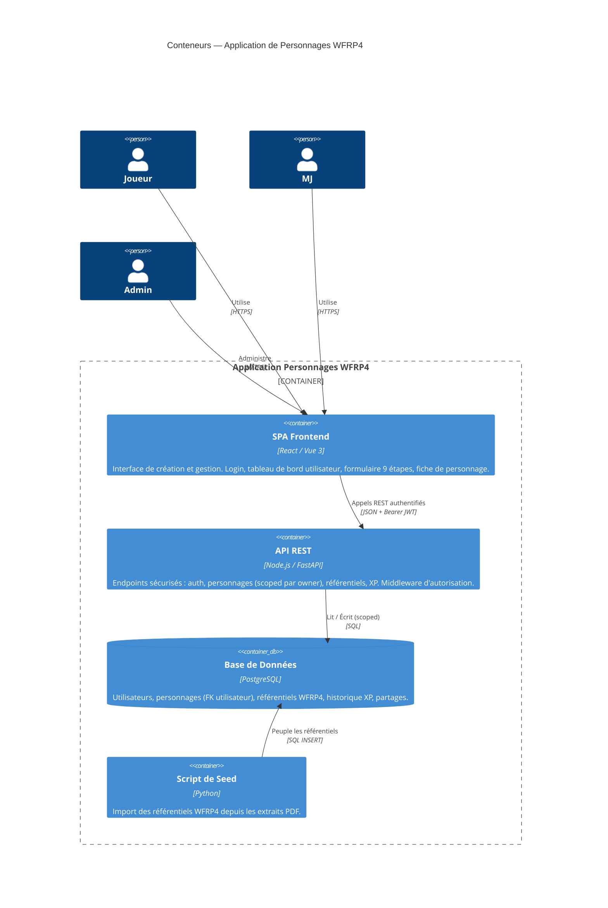
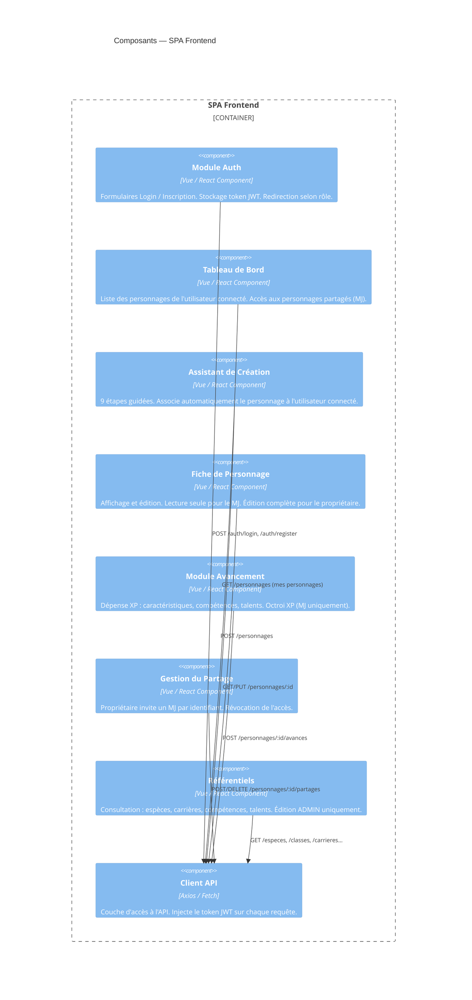
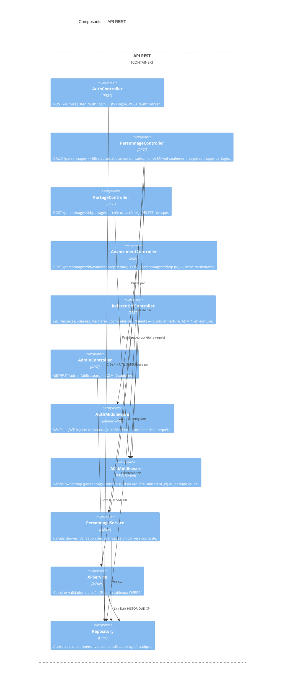

# Spécification — Application de Gestion de Personnages WFRP4

> **Version** : 0.2 — Approche utilisateur  
> **Date** : Mars 2026  
> **Source** : Warhammer Fantasy Roleplay 4e Édition — Livre de Base (FR)

---

## Table des Matières

1. [Contexte Fonctionnel](#1-contexte-fonctionnel)
2. [Modèle de Rôles Utilisateur](#2-modèle-de-rôles-utilisateur)
3. [C4 — Niveau 1 : Contexte Système](#3-c4--niveau-1--contexte-système)
4. [C4 — Niveau 2 : Conteneurs](#4-c4--niveau-2--conteneurs)
5. [C4 — Niveau 3 : Composants](#5-c4--niveau-3--composants)
6. [Modèle de Données SQL](#6-modèle-de-données-sql)
7. [Contrôle d'Accès](#7-contrôle-daccès)
8. [Contraintes et Règles Métier](#8-contraintes-et-règles-métier)
9. [Cas d'Utilisation Principaux](#9-cas-dutilisation-principaux)

---

## 1. Contexte Fonctionnel

L'application permet à des utilisateurs authentifiés de **créer, gérer et faire évoluer** des personnages conformément aux règles du Livre de Base WFRP4. Chaque personnage appartient à un utilisateur et peut être **partagé en lecture** avec un Maître de Jeu.

### Périmètre v1

| Fonctionnalité | Inclus |
|---|---|
| Inscription / connexion utilisateur | ✅ |
| Création de personnage (9 étapes) — par le propriétaire | ✅ |
| Gestion des caractéristiques et avances | ✅ |
| Gestion des compétences et avances | ✅ |
| Gestion des talents | ✅ |
| Suivi de carrière et progression | ✅ |
| Calcul XP (dépense / solde) | ✅ |
| Référentiel : espèces, classes, carrières | ✅ |
| Référentiel : compétences et talents | ✅ |
| Partage lecture MJ | ✅ |
| Export feuille de personnage (PDF) | ❌ v2 |
| Gestion de campagne / groupe | ❌ v2 |
| Gestion du combat / blessures en temps réel | ❌ v2 |

---

## 2. Modèle de Rôles Utilisateur



| Rôle | Code | Description |
|---|---|---|
| Joueur | `JOUEUR` | Propriétaire de ses personnages |
| Maître de Jeu | `MAITRE_JEU` | Lecture + octroi XP sur personnages partagés |
| Administrateur | `ADMIN` | Accès total, gestion des référentiels |

---

## 3. C4 — Niveau 1 : Contexte Système



---

## 4. C4 — Niveau 2 : Conteneurs



---

## 5. C4 — Niveau 3 : Composants

### 5.1 Frontend (SPA)



### 5.2 API REST



---

## 6. Modèle de Données SQL

### 6.1 Diagramme ERD

```mermaid
erDiagram

  UTILISATEUR {
    int       id              PK
    varchar   email           UK
    varchar   nom_affichage
    varchar   mot_de_passe_hash   "bcrypt, jamais stocké en clair"
    varchar   role                "JOUEUR | MAITRE_JEU | ADMIN"
    boolean   est_actif           "default true"
    timestamp created_at
    timestamp updated_at
    timestamp derniere_connexion
  }

  PERSONNAGE_PARTAGE {
    int       id              PK
    int       personnage_id   FK
    int       mj_utilisateur_id  FK  "-> UTILISATEUR (rôle MAITRE_JEU)"
    varchar   permission         "LECTURE | XP"  
    timestamp created_at
    timestamp expires_at         "NULL = permanent"
  }

  ESPECE {
    int      id             PK
    varchar  code           UK
    varchar  nom
    int      mouvement_base
    json     carac_initiales    "{ CC, CT, F, E, I, Ag, Dex, Int, FM, Soc }"
    text     description
  }

  CLASSE {
    int      id   PK
    varchar  code UK
    varchar  nom
    text     description
  }

  CARRIERE {
    int      id        PK
    varchar  code      UK
    varchar  nom
    int      classe_id FK
  }

  NIVEAU_CARRIERE {
    int      id                 PK
    int      carriere_id        FK
    int      niveau                  "1 à 4"
    varchar  intitule                "ex: Apprenti Apothicaire"
    varchar  statut                  "BRONZE | ARGENT | OR | PLATINE"
    int      statut_numerique        "1 à 5"
    json     avances_carac           "marqueurs h/laiton/argent/or par carac"
    text     competence_revenu
  }

  NIVEAU_CARRIERE_COMPETENCE {
    int      niveau_carriere_id FK
    int      competence_id      FK
  }

  NIVEAU_CARRIERE_TALENT {
    int      niveau_carriere_id FK
    int      talent_id          FK
  }

  NIVEAU_CARRIERE_DOTATION {
    int      id                 PK
    int      niveau_carriere_id FK
    varchar  description
  }

  COMPETENCE {
    int      id                 PK
    varchar  code               UK
    varchar  nom
    varchar  caracteristique        "CC|CT|F|E|I|Ag|Dex|Int|FM|Soc"
    boolean  est_avancee
    boolean  est_groupee
    varchar  groupe_parent
    text     description
  }

  SPECIALISATION_COMPETENCE {
    int      id            PK
    int      competence_id FK
    varchar  nom
  }

  TALENT {
    int      id          PK
    varchar  code        UK
    varchar  nom
    int      max_fois        "NULL = illimité"
    boolean  empilable
    text     description
    text     effet
  }

  ESPECE_COMPETENCE {
    int      espece_id         FK
    int      competence_id     FK
    int      avances_initiales     "default 0"
  }

  ESPECE_TALENT {
    int      espece_id FK
    int      talent_id  FK
  }

  PERSONNAGE {
    int      id                     PK
    int      utilisateur_id         FK  "propriétaire — NOT NULL"
    varchar  nom
    int      espece_id              FK
    int      carriere_courante_id   FK  "-> NIVEAU_CARRIERE"
    int      xp_total
    int      xp_depense
    int      blessures_max
    int      destin
    int      fortune
    int      resilience
    int      resolution
    int      mouvement
    varchar  motivation
    varchar  statut_social
    text     description_physique
    varchar  age
    varchar  couleur_yeux
    varchar  couleur_cheveux
    int      taille_cm
    varchar  signes_distinctifs
    boolean  est_actif               "default true"
    timestamp created_at
    timestamp updated_at
  }

  PERSONNAGE_CARACTERISTIQUE {
    int      personnage_id FK
    varchar  code               "CC|CT|F|E|I|Ag|Dex|Int|FM|Soc"
    int      valeur_initiale
    int      avances
  }

  PERSONNAGE_COMPETENCE {
    int      personnage_id     FK
    int      competence_id     FK
    int      avances
    int      specialisation_id FK  "NULL si pas de spécialisation"
  }

  PERSONNAGE_TALENT {
    int      personnage_id FK
    int      talent_id     FK
    int      fois
  }

  HISTORIQUE_XP {
    int       id             PK
    int       personnage_id  FK
    int       auteur_id      FK  "-> UTILISATEUR (propriétaire ou MJ)"
    int       montant            "positif=gagné, négatif=dépensé"
    varchar   type               "GAIN | CARAC | COMPETENCE | TALENT | CARRIERE"
    varchar   cible
    text      notes
    timestamp created_at
  }

  PERSONNAGE_CARRIERE {
    int       id                   PK
    int       personnage_id        FK
    int       niveau_carriere_id   FK
    boolean   est_courante
    timestamp date_entree
    timestamp date_sortie
  }

  UTILISATEUR          ||--o{ PERSONNAGE              : "possède"
  UTILISATEUR          ||--o{ PERSONNAGE_PARTAGE      : "est MJ de"
  PERSONNAGE           ||--o{ PERSONNAGE_PARTAGE      : "partagé via"
  UTILISATEUR          ||--o{ HISTORIQUE_XP           : "auteur de"
  ESPECE               ||--o{ PERSONNAGE              : "espèce de"
  NIVEAU_CARRIERE      ||--o{ PERSONNAGE              : "carrière courante"
  CLASSE               ||--o{ CARRIERE                : "contient"
  CARRIERE             ||--o{ NIVEAU_CARRIERE         : "comprend"
  NIVEAU_CARRIERE      ||--o{ NIVEAU_CARRIERE_COMPETENCE : "donne accès à"
  COMPETENCE           ||--o{ NIVEAU_CARRIERE_COMPETENCE : "listée dans"
  NIVEAU_CARRIERE      ||--o{ NIVEAU_CARRIERE_TALENT  : "donne accès à"
  TALENT               ||--o{ NIVEAU_CARRIERE_TALENT  : "listé dans"
  NIVEAU_CARRIERE      ||--o{ NIVEAU_CARRIERE_DOTATION : "fournit"
  ESPECE               ||--o{ ESPECE_COMPETENCE       : "donne"
  COMPETENCE           ||--o{ ESPECE_COMPETENCE       : "reçue par espèce"
  ESPECE               ||--o{ ESPECE_TALENT           : "donne"
  TALENT               ||--o{ ESPECE_TALENT           : "reçu par espèce"
  COMPETENCE           ||--o{ SPECIALISATION_COMPETENCE : "se spécialise en"
  PERSONNAGE           ||--o{ PERSONNAGE_CARACTERISTIQUE : "possède"
  PERSONNAGE           ||--o{ PERSONNAGE_COMPETENCE   : "maîtrise"
  COMPETENCE           ||--o{ PERSONNAGE_COMPETENCE   : "pratiquée par"
  PERSONNAGE           ||--o{ PERSONNAGE_TALENT       : "possède"
  TALENT               ||--o{ PERSONNAGE_TALENT       : "maîtrisé par"
  PERSONNAGE           ||--o{ HISTORIQUE_XP           : "accumule"
  PERSONNAGE           ||--o{ PERSONNAGE_CARRIERE     : "a suivi"
  NIVEAU_CARRIERE      ||--o{ PERSONNAGE_CARRIERE     : "occupé par"
```



### 6.2 Table `UTILISATEUR` — détails

| Colonne | Contrainte | Note sécurité |
|---|---|---|
| `email` | UNIQUE, NOT NULL | Normalisé en minuscule avant stockage |
| `mot_de_passe_hash` | NOT NULL | bcrypt (cost ≥ 12), jamais loggué |
| `role` | ENUM, default `JOUEUR` | Seul un ADMIN peut changer le rôle |
| `est_actif` | default `true` | Soft-delete : désactivation sans suppression |
| `derniere_connexion` | nullable | Mise à jour à chaque login réussi |

### 6.3 Tableaux de coût XP (source : Livre de Base p. 47)

| Avances | Coût/avance Caractéristique | Coût/avance Compétence |
|---|---|---|
| 0 – 5 | 25 XP | 10 XP |
| 6 – 10 | 30 XP | 15 XP |
| 11 – 15 | 40 XP | 20 XP |
| 16 – 20 | 50 XP | 30 XP |
| 21 – 25 | 70 XP | 40 XP |
| 26 – 30 | 90 XP | 60 XP |
| 31 – 35 | 120 XP | 80 XP |
| 36 – 40 | 150 XP | 110 XP |
| 41 – 45 | 190 XP | 140 XP |
| 46 – 50 | 230 XP | 180 XP |

### 6.4 Attributs dérivés (calculés, non stockés)

| Attribut | Formule |
|---|---|
| Valeur Caractéristique | `valeur_initiale + avances` |
| Bonus de Caractéristique | `floor(valeur / 10)` |
| Blessures | `E_bonus + F_bonus + FM_bonus` (selon espèce) |
| XP restant | `xp_total - xp_depense` |

---

## 7. Contrôle d'Accès

### Matrice de permissions sur `PERSONNAGE`

| Action | JOUEUR (propriétaire) | JOUEUR (autre) | MAITRE_JEU (partagé) | MAITRE_JEU (non partagé) | ADMIN |
|---|---|---|---|---|---|
| Créer | ✅ | — | — | — | ✅ |
| Lire fiche | ✅ | ❌ | ✅ | ❌ | ✅ |
| Modifier fiche | ✅ | ❌ | ❌ | ❌ | ✅ |
| Dépenser XP | ✅ | ❌ | ❌ | ❌ | ✅ |
| Octroyer XP | ❌ | ❌ | ✅ (`permission=XP`) | ❌ | ✅ |
| Partager | ✅ | ❌ | ❌ | ❌ | ✅ |
| Supprimer | ✅ | ❌ | ❌ | ❌ | ✅ |

### Règles d'implémentation

- L'`AuthMiddleware` vérifie et décode le JWT à chaque requête.
- L'`ACLMiddleware` charge `PERSONNAGE.utilisateur_id` et vérifie que l'appelant est le propriétaire **ou** qu'il existe un enregistrement valide dans `PERSONNAGE_PARTAGE`.
- La colonne `PERSONNAGE.utilisateur_id` est indexée et jamais nullable.
- Aucune route de lecture de personnage ne retourne de résultats hors périmètre de l'utilisateur connecté (pas de fuite de données par énumération).
- Le mot de passe n'est jamais renvoyé dans aucune réponse API.

---

## 8. Contraintes et Règles Métier

### Avancement

- Un personnage ne peut avancer **que les caractéristiques de son niveau de carrière** (et niveaux inférieurs si multicarrière).
- Un personnage ne peut avancer **que les compétences listées** à son niveau de carrière ou inférieur.
- Un talent acheté plusieurs fois augmente son effet empilable uniquement si `empilable = true` et `fois < max_fois`.

### Changement de carrière

- Vers une carrière de **même classe** : accès libre.
- Vers une carrière de **classe différente** : nécessite de compléter le niveau actuel — règle p. 48.
- L'historique des carrières est conservé dans `PERSONNAGE_CARRIERE`.

### Espèces

- Chaque espèce a des caractéristiques initiales dans `ESPECE.carac_initiales`.
- Certaines espèces ont des talents obligatoires (`ESPECE_TALENT`) et des compétences avec avances initiales (`ESPECE_COMPETENCE.avances_initiales`).

### XP

- `xp_depense` = somme des lignes négatives de `HISTORIQUE_XP`.
- `xp_restant` = calculé, jamais stocké.
- Chaque ligne `HISTORIQUE_XP` enregistre l'`auteur_id` (joueur ou MJ).

---

## 9. Cas d'Utilisation Principaux

### UC-00 — Inscription et Connexion

```
1. Utilisateur s'inscrit (email, mot de passe, pseudo)
2. Système hache le mot de passe (bcrypt)
3. Système crée UTILISATEUR avec role=JOUEUR
4. À la connexion : vérification du hash → émission d'un JWT (exp: 24h)
5. Le frontend stocke le JWT (mémoire ou httpOnly cookie)
```

### UC-01 — Création d'un personnage (9 étapes)

```
1. Utilisateur connecté (JOUEUR) démarre l'assistant
2. Choisir ou tirer l'espèce (aléatoire +20 XP)
3. Choisir ou tirer la classe et la carrière
4. Tirer les caractéristiques (2d10 + base espèce)
5. Copier compétences et talents d'espèce et de carrière
6. Appliquer les dotations de classe et de carrière
7. Renseigner nom, âge, apparence
8. Définir la motivation
9. POST /personnages — le système associe utilisateur_id = JWT.sub
```

### UC-02 — Dépenser de l'XP (propriétaire)

```
1. Joueur sélectionne : Caractéristique | Compétence | Talent
2. ACLMiddleware : vérifie personnage.utilisateur_id == JWT.sub
3. Système vérifie la cible dans le plan d'avancement de la carrière courante
4. Système calcule le coût selon tableau officiel
5. Système vérifie xp_restant >= coût
6. Système enregistre l'avance + HISTORIQUE_XP (auteur_id = JWT.sub)
```

### UC-03 — Partager un personnage avec un MJ

```
1. Propriétaire saisit l'email du MJ
2. Système vérifie que l'utilisateur cible a le rôle MAITRE_JEU
3. Système crée PERSONNAGE_PARTAGE (permission=LECTURE ou XP)
4. Le MJ voit le personnage dans son tableau de bord
```

### UC-04 — Octroi d'XP par le MJ

```
1. MJ consulte un personnage partagé
2. ACLMiddleware : vérifie PERSONNAGE_PARTAGE (mj_utilisateur_id == JWT.sub, permission=XP)
3. MJ saisit le montant et la raison
4. Système insère dans HISTORIQUE_XP (type=GAIN, auteur_id=MJ, montant=positif)
5. Système met à jour PERSONNAGE.xp_total
```

### UC-05 — Changer de carrière (propriétaire)

```
1. Joueur choisit une nouvelle carrière
2. ACLMiddleware : vérifie ownership
3. Système vérifie compatibilité (même classe ou niveau complété)
4. Système crée PERSONNAGE_CARRIERE (est_courante=true, ancienne=false)
5. Système met à jour PERSONNAGE.carriere_courante_id
6. Insère dans HISTORIQUE_XP si coût applicable
```

---

*Prochain jalon : DDL complet (CREATE TABLE avec contraintes) + contrat OpenAPI/Swagger.*
