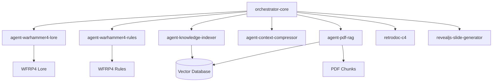
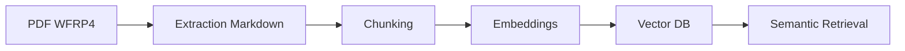
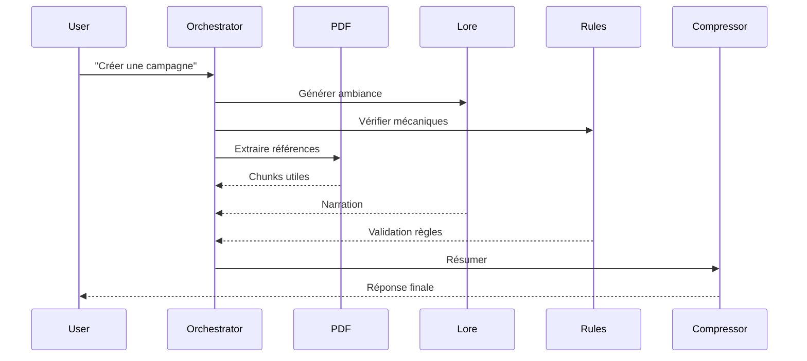

# ⚔️ WARHAMMER 4 AI SQUAD

## Industrialisation IA pour Warhammer Fantasy Roleplay 4e édition

Cette squad d’agents IA est spécialisée dans :
- l’exploitation du livre de base WFRP4,
- l’analyse PDF,
- la génération narrative,
- les règles de jeu,
- la documentation,
- l’orchestration multi-agents optimisée en consommation de tokens.

---

# 🏛️ Architecture Globale

---

# 🎭 agent-warhammer4-lore

## Rôle

Expert de l’univers Warhammer Fantasy Roleplay 4.

## Responsabilités

- lore impérial,
- religions,
- factions,
- villes,
- ambiance,
- PNJ,
- intrigues,
- narration,
- cohérence roleplay.

---

# ⚔️ agent-warhammer4-rules

## Rôle

Expert mécanique WFRP4.

## Responsabilités

- combat,
- critiques,
- corruption,
- psychologie,
- magie,
- tests,
- carrières,
- blessures,
- création de personnages.

---

# 📚 agent-pdf-rag

## Pipeline

## Responsabilités

- parsing PDF,
- extraction structure,
- embeddings,
- retrieval,
- citations,
- résumés.

---

# 🗜️ agent-context-compressor

## Objectif

Réduire :
- coûts IA,
- bruit,
- contexte inutile.

---

# 🧭 agent-knowledge-indexer

## Produit

- index des chapitres,
- cartes mentales,
- taxonomie WFRP4,
- glossary.

---

# 🏗️ retrodoc-c4

## Produit

- C4 Model,
- documentation technique,
- diagrammes,
- dépendances.

---

# 🎬 revealjs-slide-generator

## Produit

- slides Markdown,
- Mermaid,
- storytelling,
- architecture squad.

---

# 🧱 Structure RAG

| Type | Taille |
|---|---|
| Lore | 1200-1800 tokens |
| Règles | 600-1000 tokens |
| Tables | 300-500 tokens |
| Bestiaire | 400-800 tokens |

---

# 🏰 Workflow type

